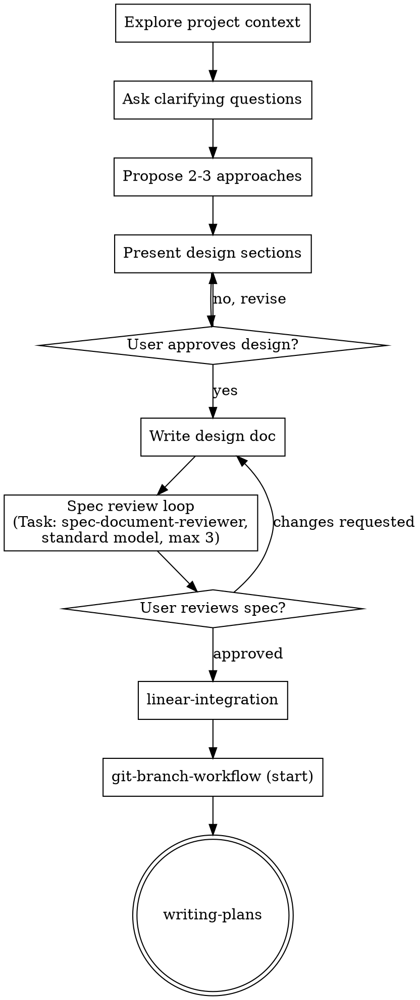

# Brainstorming Ideas Into Designs

Help turn ideas into fully formed designs and specs through natural collaborative dialogue.

Start by understanding the current project context, then ask questions one at a time to refine the idea. Once you understand what you are building, present the design and get user approval.

<HARD-GATE>
Do NOT invoke any implementation skill, write any code, scaffold any project, or take any implementation action until you have presented a design and the user has approved it. This applies to EVERY project regardless of perceived simplicity.
</HARD-GATE>

## Anti-Pattern: "This Is Too Simple To Need A Design"

Every project goes through this process. A todo list, a single-function utility, a config change — all of them. "Simple" projects are where unexamined assumptions cause the most wasted work. The design can be short (a few sentences for truly simple projects), but you MUST present it and get approval.

## Checklist

You MUST create a task for each of these items and complete them in order:

1. **Explore project context** — check files, docs, recent commits
2. **Ask clarifying questions** — one at a time; understand purpose, constraints, and success criteria
3. **Propose 2–3 approaches** — with trade-offs and your recommendation
4. **Present design** — in sections scaled to their complexity; get user approval after each section
5. **Write design doc** — save to `docs/specs/YYYY-MM-DD-<topic>-design.md` and commit (user preferences for spec location override this default)
6. **Spec review loop** — use Cursor’s **Task** tool to dispatch a spec-document-reviewer subagent (see `skills/brainstorming/spec-document-reviewer-prompt.md`); use the **standard** model profile (**claude-4.6-sonnet-medium**). Address reported issues in the spec; repeat until approved or you reach **3 iterations**, whichever comes first
7. **User reviews written spec** — ask the user to review the spec file before proceeding
8. **Transition to implementation** — follow **linear-integration** (link or confirm Linear issue as appropriate) → **git-branch-workflow** (**start**) → **writing-plans**

## Process Flow

**Terminal state:** after the user approves the written spec, run **linear-integration**, then **git-branch-workflow** with the **start** action, then invoke **writing-plans**. Do not skip to coding, frontend-only tooling, or other implementation paths before that sequence.

## The Process

**Understanding the idea:**

- Check the current project state first (files, docs, recent commits)
- Before asking detailed questions, assess scope: if the request describes multiple independent subsystems (for example, a platform with chat, file storage, billing, and analytics), flag this immediately. Do not spend questions refining details of a project that needs to be decomposed first
- If the project is too large for a single spec, help the user decompose into sub-projects: what are the independent pieces, how do they relate, what order should they be built? Then brainstorm the first sub-project through the normal design flow. Each sub-project gets its own spec → plan → implementation cycle
- For appropriately scoped projects, ask questions one at a time to refine the idea
- Prefer multiple-choice questions when possible; open-ended is fine when needed
- Only one question per message — if a topic needs more exploration, break it into multiple questions
- Focus on understanding: purpose, constraints, success criteria

**Exploring approaches:**

- Propose 2–3 different approaches with trade-offs
- Present options conversationally with your recommendation and reasoning
- Lead with your recommended option and explain why

**Presenting the design:**

- Once you believe you understand what you are building, present the design
- Scale each section to its complexity: a few sentences if straightforward, up to roughly 200–300 words if nuanced
- Ask after each section whether it looks right so far
- Cover: architecture, components, data flow, error handling, and how you will know the change works (verification), at a level appropriate to the project
- Be ready to go back and clarify if something does not make sense

**Design for isolation and clarity:**

- Break the system into smaller units that each have one clear purpose, communicate through well-defined interfaces, and can be understood and tested independently
- For each unit, you should be able to answer: what does it do, how do you use it, and what does it depend on?
- Can someone understand what a unit does without reading its internals? Can you change the internals without breaking consumers? If not, the boundaries need work
- Smaller, well-bounded units are also easier to work with: you reason better about code you can hold in context at once, and edits are more reliable when files are focused. When a file grows large, that is often a signal that it is doing too much

**Working in existing codebases:**

- Explore the current structure before proposing changes. Follow existing patterns
- Where existing code has problems that affect the work (for example, a file that has grown too large, unclear boundaries, tangled responsibilities), include targeted improvements as part of the design — the way a good developer improves code they are working in
- Do not propose unrelated refactoring. Stay focused on what serves the current goal

## After the Design

**Documentation:**

- Write the validated design (spec) to `docs/specs/YYYY-MM-DD-<topic>-design.md` (user preferences for spec location override this default)
- Commit the design document to git

**Spec review loop (subagent):**

1. Dispatch the reviewer using Cursor’s **Task** tool. Load the prompt template from `skills/brainstorming/spec-document-reviewer-prompt.md`, substitute the actual spec path for `[SPEC_FILE_PATH]`, and run the subagent with the **standard** model (**claude-4.6-sonnet-medium**).
2. If the reviewer reports **Issues Found**, fix the spec, commit if you use version control for docs, and dispatch again. Stop when the reviewer **Approves** or after **3** review rounds — if still not clean after three rounds, summarize remaining risks for the user and decide together whether to revise the spec or proceed with explicit caveats.

**User review gate:**

After the spec review loop, ask the user to review the written spec before continuing:

> Spec written and committed to `<path>`. Please review it and let me know if you want any changes before we continue to Linear, branch setup, and the implementation plan.

Wait for the user’s response. If they request changes, update the spec, re-run the spec review loop (still respecting the iteration cap from the current round’s baseline), and only proceed once they approve.

**Implementation handoff:**

1. **linear-integration** — link or confirm the Linear issue for this work (or follow that skill when no issue applies).
2. **git-branch-workflow** — **start** a branch appropriate to the issue or task.
3. **writing-plans** — produce the detailed implementation plan from the approved spec.

Do not invoke other implementation skills before **writing-plans** completes for this spec.

## Key Principles

- **One question at a time** — Do not overwhelm with multiple questions
- **Multiple choice preferred** — Easier to answer than open-ended when possible
- **YAGNI ruthlessly** — Remove unnecessary features from all designs
- **Explore alternatives** — Always propose 2–3 approaches before settling
- **Incremental validation** — Present design; get approval before moving on
- **Be flexible** — Go back and clarify when something does not make sense
