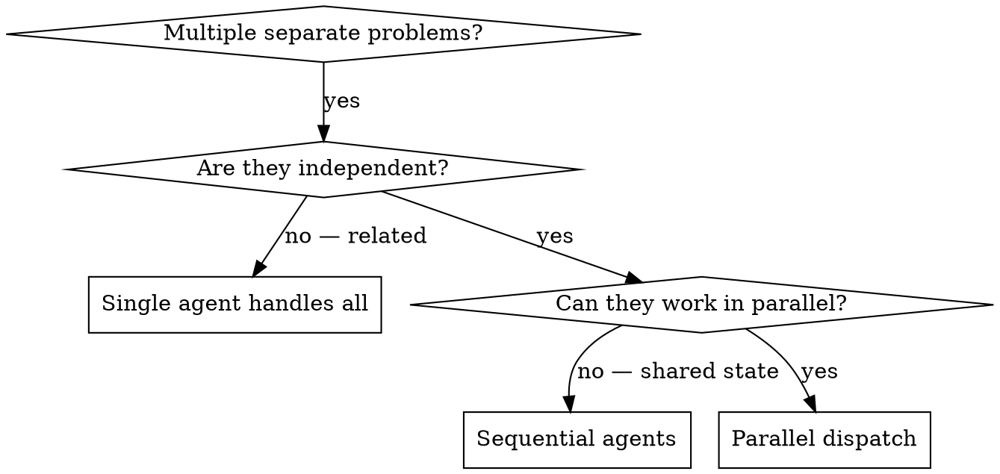

# Dispatching Parallel Tasks

## Overview

Delegate work to specialized subagents with **isolated context**. Craft their instructions so they never inherit your session history—you supply exactly what they need. That keeps each agent focused and preserves your context for coordination.

When you have several unrelated problems (different areas of the codebase, different bugs, different features), solving them one after another wastes wall-clock time. If each piece can be understood and changed without depending on the others, run them **in parallel**.

**Core principle:** One agent per independent problem domain. Dispatch concurrently when the tool allows it.

## When to Use



**Use when:**

- Several failures or work items with **different** root causes or owners in code
- Multiple subsystems or files can be fixed or built **without** reading each other’s in-progress edits
- No ordering requirement: outcome A does not unblock understanding of B
- Agents will not fight over the same files, locks, or mutable resources

**Do not use when:** (see [When NOT to Use](#when-not-to-use))

## The Pattern

### 1. Identify Independent Domains

Group work by **what** is broken or **what** must be delivered, not by who is available. Example groupings:

- Module A: configuration parsing
- Module B: UI state for one screen
- Module C: API client retry behavior

If fixing A does not require half-done changes from B, they are candidates for parallel agents.

### 2. Create Focused Tasks

Each task should include:

- **Scope:** One subsystem, feature slice, or bug cluster
- **Goal:** A concrete outcome (e.g. “behavior X works”, “regression Y gone”)
- **Constraints:** What not to touch; repo or style rules that matter
- **Expected output:** What the agent must return (summary, file list, risks)

### 3. Dispatch in Parallel

Use your platform's subagent tool once per independent domain — `Agent` in Claude Code, `Task` in Cursor. Send a **single message** with multiple subagent invocations so they run concurrently.

Pick a model tier per subagent to match difficulty:

| Tier | Use for |
|------|---------|
| **fast** | Mechanical edits, grep-level fixes, straightforward refactors, docstring or config tweaks |
| **standard** | Most feature work, bugfixes that touch several files, wiring and integration |
| **strong** | Ambiguous requirements, cross-cutting design, performance or concurrency reasoning, large refactors |

(See `subagent-development/SKILL.md` for the tier-to-model mapping per platform.)

Illustrative shape (Claude Code `Agent` / Cursor `Task` — adjust to your platform's syntax):

```text
dispatch({ description: "Fix parser edge cases", prompt: "...", model: "<fast-tier>" })
dispatch({ description: "Wire settings screen to store", prompt: "...", model: "<standard-tier>" })
dispatch({ description: "Unify error handling strategy", prompt: "...", model: "<strong-tier>" })
```

Each `prompt` must be **self-contained**: paths, errors, acceptance criteria, and forbidden areas—everything a fresh agent needs without your chat history.

### 4. Review and Integrate

When agents finish, merge their outcomes deliberately: read outputs, reconcile overlapping files, run your project’s verification (build, tests, lint—whatever the repo uses). Do not assume parallel edits always compose without conflict.

## Agent Prompt Structure

Effective prompts are:

1. **Focused** — one clear domain per agent  
2. **Self-contained** — reproduction steps, paths, errors, and constraints included  
3. **Explicit about deliverables** — what to return and in what form  

**Example skeleton:**

```markdown
## Scope
Only `src/billing/` and `tests/billing/`. Do not change `src/auth/`.

## Problem
Invoices with zero line items throw in `InvoiceTotals.cs` line 88. Log: [paste].

## Goal
Valid empty invoices should total 0 and pass validation.

## Steps
1. Read `InvoiceTotals` and call sites.
2. Fix without changing public API of `IInvoiceRepository`.
3. Note any follow-ups for the team.

## Return
- Root cause (short)
- Files changed
- How you verified
```

## Common Mistakes

**Too broad:** “Improve the app” — the agent drifts.  
**Specific:** “Fix zero-line-item totals in billing” with paths.

**No context:** “Fix the crash” — no stack trace or file.  
**Context:** Paste error, version, and relevant code references.

**No constraints:** Agent refactors unrelated modules.  
**Constraints:** “Touch only these paths” or “no API breaks.”

**Vague output:** “Done.”  
**Specific:** “Return root cause, diff summary, and verification command you ran.”

**Wrong model:** Using **strong** for typo fixes wastes time; using **fast** for architectural tradeoffs invites shallow answers.

## When NOT to Use

- **Related root causes** — fixing one item likely fixes others; one investigation first  
- **Full-system reasoning** — need one picture of the whole architecture or runtime  
- **Exploratory work** — you do not yet know where the problem lives  
- **Shared state** — same files, branches, or resources would cause merge or logic conflicts  
- **Strict ordering** — step B genuinely requires completed output from step A  

## Verification After Agents Return

1. **Read every summary** — understand what each agent changed and assumed  
2. **Check for overlap** — same files edited twice; incompatible API choices  
3. **Run full project checks** — build, automated tests, linters as defined by the repo  
4. **Spot-check risky areas** — agents can be systematically wrong on edge cases or conventions  

Only treat the work as done after integration passes your bar, not when individual agents report success in isolation.

## Why This Helps

- **Wall-clock** — several investigations or implementations overlap  
- **Focus** — narrow prompts reduce context noise per agent  
- **Isolation** — fewer cross-talk mistakes when domains are truly separate  
- **Your bandwidth** — you coordinate and integrate instead of executing every thread serially yourself
