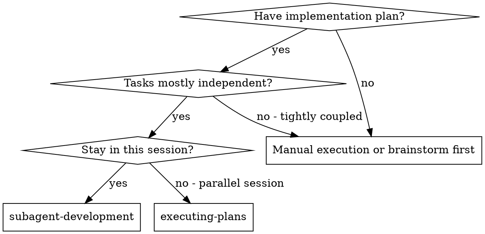
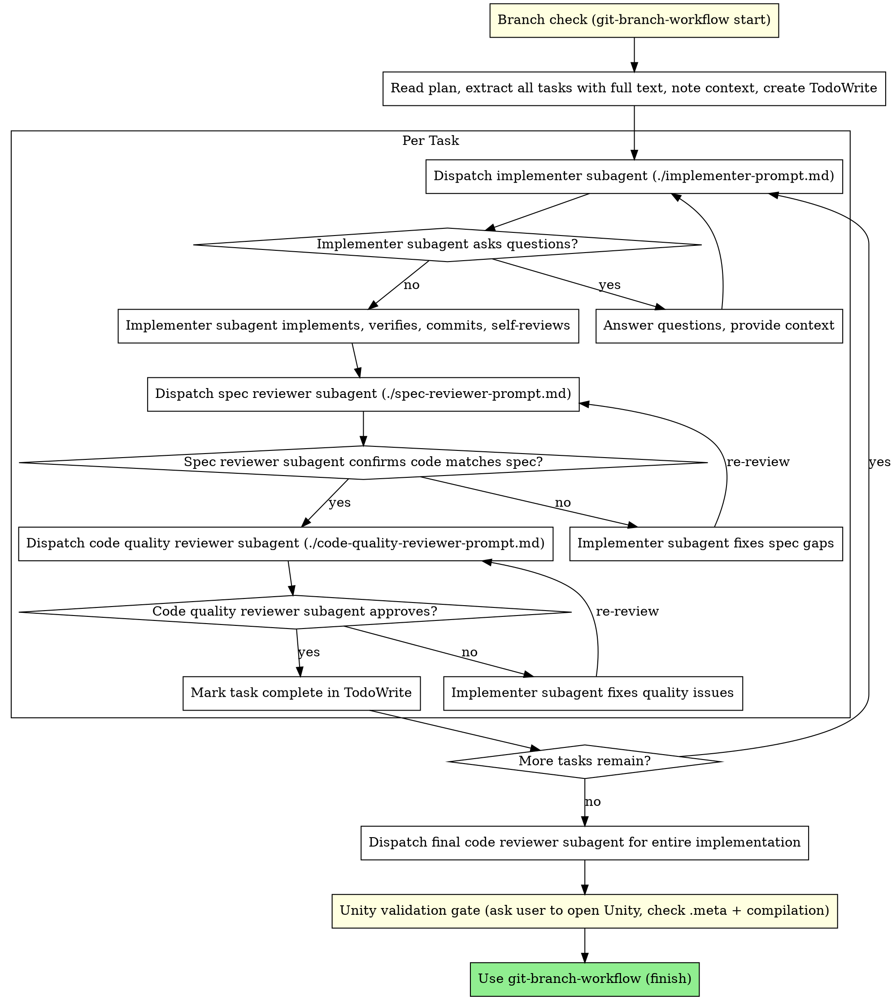

# Subagent development

Execute a plan by dispatching a fresh subagent per task, with **two-stage review** after each: **spec compliance** first, then **code quality**.

**Why subagents:** You delegate tasks to specialized agents with isolated context. By precisely crafting their instructions and context, you keep them focused. They should not inherit your session history—you supply exactly what they need. That preserves your context for coordination.

**Core principle:** Fresh subagent per task + two-stage review (spec then quality) = high quality, fast iteration.

## When to use



**vs. executing plans (parallel session):**
- Same session (no context switch away from this chat).
- Fresh subagent per task (no context pollution).
- Two-stage review after each task: spec compliance first, then code quality.
- Faster iteration than human-in-the-loop between every task.

## The process



## Model selection

Use the **least capable model that still fits the role** to balance cost, latency, and quality.

| Tier | Model name | Use for |
|------|------------|---------|
| **fast** | `composer-2-fast` | Mechanical work: 1–2 files, clear spec, straightforward edits |
| **standard** | `claude-4.6-sonnet-medium` | Multi-file work, integration, judgment calls, **spec compliance review**, **code quality review** |
| **strong** | `claude-4.6-opus-high` | Architecture, design, hard debugging, escalation when standard is insufficient |

**In Cursor:** Invoke the **Task** tool with `model: "fast"` when dispatching a subagent that should run on the fast tier (mechanical implementer tasks). For standard or strong tiers, use the Task tool’s default or the appropriate model setting your environment maps to those names.

**Implementer subagent:**
- 1–2 files, complete spec, low ambiguity → **fast** (`composer-2-fast`) + `model: "fast"` on Task.
- Multiple files, integration, or meaningful judgment → **standard**.
- Blocked after escalation, or task needs architectural reasoning → **strong** (or re-scope the task).

**Spec compliance reviewer:** always **standard** (`claude-4.6-sonnet-medium`).

**Code quality reviewer:** **standard** by default. Escalate to **strong** (`claude-4.6-opus-high`) if the change is large, security-sensitive, or the standard review surface area is too broad to trust.

**Signals:**
- Touches 1–2 files with a complete spec → fast implementer.
- Touches many files or cross-cutting behavior → standard implementer.
- Needs design judgment or deep codebase understanding → strong implementer or smaller tasks.

## Handling implementer status

Implementer subagents report one of four statuses:

**DONE:** Proceed to spec compliance review.

**DONE_WITH_CONCERNS:** Work is done but doubts were flagged. Read concerns before proceeding. If they affect correctness or scope, address them before review. If they are observations (e.g. file size), note and proceed.

**NEEDS_CONTEXT:** Missing information. Supply it and re-dispatch the implementer.

**BLOCKED:** Cannot complete. Then:
1. If context was insufficient, add context and re-dispatch (same or higher tier).
2. If the task needs more reasoning, re-dispatch with a **stronger** model.
3. If the task is too large, split it.
4. If the plan is wrong, escalate to the human.

**Never** ignore escalation or retry the same prompt and model with no change. If the implementer is stuck, something about context, scope, model, or plan must change.

## Prompt templates

- `./implementer-prompt.md` — implementer subagent
- `./spec-reviewer-prompt.md` — spec compliance reviewer
- `./code-quality-reviewer-prompt.md` — code quality reviewer

## Branch check (before first task)

Before dispatching any implementer, verify your branch state:

1. Run `git branch --show-current`.
2. If you are on `main`, `master`, or `develop` — **stop**. Invoke **git-branch-workflow** (Starting work) to create a sub-feature branch before any code changes.
3. If the current branch is a feature branch but this plan warrants its own sub-feature branch — invoke **git-branch-workflow** (Starting work).
4. If brainstorming or writing-plans-lean already created the branch — confirm it is checked out and proceed.

Do not skip this step even if the plan does not mention branching.

## Example workflow

```
You: I'm using subagent-development to execute this plan.

[Branch check: git branch --show-current → create sub-feature branch if needed]
[Read plan once, extract all tasks with full text and context]
[Create TodoWrite with all tasks]

Task 1: Hook installation script

[Dispatch implementer with Task + model per complexity]

Implementer: "Before I begin—hook at user or system level?"
You: "User level (~/.config/...)."

Implementer: Implements, verifies build/acceptance criteria, self-reviews, commits.
[Dispatch spec reviewer — standard model]
Spec reviewer: Spec compliant—all requirements met, nothing extra.

[Dispatch code quality reviewer — standard model, with BASE/HEAD SHAs]
Code reviewer: Strengths: clear structure. Issues: none. Approved.

[Mark Task 1 complete]

Task 2: Recovery modes

[Dispatch implementer]

Implementer: No questions; implements and verifies.

[Spec reviewer]
Spec reviewer: Issues: missing progress reporting; extra --json flag.

[Implementer fixes; spec re-review passes]

[Code quality reviewer]
Code reviewer: Important: magic number 100.

[Implementer extracts constant; code reviewer approves]

[Mark Task 2 complete]

...

[After all tasks: final code reviewer on full diff]

[Unity validation gate: ask user to open Unity Editor, generate .meta files, check compilation — WAIT for confirmation]
[Commit .meta files]

[Use git-branch-workflow — finishing: squash, PR/merge, cleanup per that skill]
```

## Advantages

**vs. manual execution:**
- Fresh context per task.
- Parallel-safe at the repo level if only one implementer runs at a time per branch.
- Questions surface before and during work.

**vs. executing plans (parallel session):**
- Same session, continuous progress.
- Automatic review checkpoints.

**Efficiency:**
- Controller passes full task text—subagent does not re-read the whole plan file.
- Controller curates context; subagent gets a complete packet up front.

**Quality gates:**
- Self-review before handoff.
- Spec then quality; loops until approved.
- Spec step prevents over/under-building; quality step keeps implementation maintainable.

**Cost:** More Task invocations per task (implementer + two reviewers) and possible re-review loops; early catches are usually cheaper than late defects.

## Red flags

**Never:**
- Start implementation on `main`/`master` without explicit user consent.
- Skip the **Unity validation gate** — always ask the user to open Unity and confirm before finishing.
- Skip spec compliance or code quality review.
- Proceed with unfixed reviewer findings.
- Run **multiple implementer subagents in parallel** on the same branch (merge conflicts).
- Make the subagent read the whole plan file—paste the task + context.
- Skip scene-setting context.
- Ignore implementer questions.
- Treat spec as satisfied while the spec reviewer still has issues.
- Skip re-review after fixes.
- Let self-review replace real review—both matter.
- Start **code quality** review before **spec** review is ✅.
- Move to the next task while either review has open issues.

**If the implementer asks questions:** Answer clearly; do not rush them into coding.

**If a reviewer finds issues:** Same implementer fixes → same reviewer type re-runs → repeat until approved.

**If a subagent fails the task:** Re-dispatch with explicit fix instructions rather than patching everything yourself (avoids polluting your coordination context).

## Integration

**Related skills:**
- **writing-plans-lean** — produces the plan this skill executes.
- **requesting-code-review** — template at `requesting-code-review/code-reviewer.md` for reviewer-style output (code quality step references it).
- **git-branch-workflow** — **finishing** phase after all tasks (squash, merge/PR, cleanup, Linear, etc.).

**Alternative workflow:**
- **executing-plans** — use when work should continue in a **parallel session** instead of this one.
