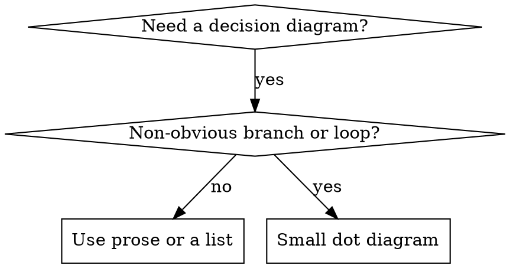

# Writing Skills

## Overview

A **skill** is durable documentation the agent loads when a task matches its description. This meta-skill describes how to author skills that are easy to find, cheap in tokens, and safe to reuse.

**Where skills live**

| Scope | Path |
|--------|------|
| Personal (all projects) | `~/.cursor/skills/` |
| Project (repo-only) | `.cursor/skills/` |

**Never** put custom skills in `~/.cursor/skills-cursor/` — that tree is reserved for Cursor built-in skills.

**Flat namespace:** each skill is a folder `skill-name/` with `SKILL.md` at its root (plus optional files). Name folders so they sort and search well.

## What is a Skill?

**Skills are:** reusable techniques, patterns, tools, and reference guides.

**Skills are not:** one-off session stories or “how we fixed it that Tuesday.”

## When to Create a Skill

**Create when:**

- The technique was not obvious and you would use it again.
- The idea applies across projects or teammates.
- A short guide beats re-deriving the same steps.

**Do not create for:**

- Single-use hacks.
- Material already well covered by official docs (link instead).
- Repo-specific rules that belong in `AGENTS.md` / project docs.
- Anything enforceable purely by tooling (lint, CI) — automate when you can.

## Skill Types

| Type | Role | Examples |
|------|------|----------|
| **Technique** | Steps to execute under conditions | condition-based waiting, root-cause tracing |
| **Pattern** | Mental model or structure | flatten-with-flags, invariant checks |
| **Reference** | Lookup material | API surface, command flags, schema notes |

## Directory Structure

```
skills/
  skill-name/
    SKILL.md              # required
    supporting-file.*     # only if needed
```

**Split into extra files when:**

1. Reference bulk (roughly 100+ lines of API or spec).
2. Reusable assets (scripts, templates, prompts) the skill points to.

**Keep in SKILL.md:** principles, short patterns (about 50 lines or fewer), decision rules.

## SKILL.md Structure

**YAML frontmatter (only these keys):**

- `name` — letters, numbers, hyphens; no spaces or special punctuation.
- `description` — third person; **when to use**, not a summary of the workflow (see CSO). Prefer “Use when…”. Keep under ~500 characters when possible. **Total** frontmatter under 1024 characters.

**Body outline:**

```markdown
# Title

## Overview
1–2 sentences: what this is and the core idea.

## When to Use
Small flowchart only if the decision is non-obvious. Bullets: symptoms, contexts. When **not** to use.

## Core Pattern   # techniques / patterns
Before/after or numbered steps.

## Quick Reference
Table or scannable bullets.

## Implementation
Short code inline; link out for heavy reference or tools.

## Common Mistakes
Failure modes and fixes.

## Real-World Impact   # optional
Concrete payoff (metrics, time saved, risk reduced).
```

## Cursor Search Optimization (CSO)

Future turns match skills mainly via **name**, **description**, and **in-body keywords**. Optimize for that.

### 1. Rich description

The description should answer: *should I open this skill for this message?*

- Start with **Use when…** and list **triggers** (symptoms, situations), not the procedure inside the skill.
- If the description narrates the workflow, models may follow the blurb and skip the body — keep process detail in the markdown, not in YAML.

```yaml
# Bad — summarizes workflow
description: Use when reviewing code between every task with two review stages

# Good — triggers only
description: Use when executing multi-step plans with independent tasks in the same session
```

### 2. Keyword coverage

Include words people (and models) would grep for: error strings, symptoms (“flaky”, “hang”), synonyms, tool and file names where relevant.

### 3. Descriptive naming

Verb-first or gerund process names: `writing-skills`, `condition-based-waiting`, not vague nouns like `helpers` or `misc`.

### 4. Token efficiency

Skills that load often should stay **short**.

- Prefer one sharp example over five shallow ones.
- Point to `--help` or upstream docs instead of copying every flag.
- Do not duplicate another skill’s steps; **cross-reference** by name (see below).

Rough targets: entry or high-frequency skills **about 200 words or fewer** where feasible; others stay as tight as clarity allows. Check length with `wc -w path/to/SKILL.md` if needed.

### 5. Cross-referencing other skills

Use the **skill folder name** in prose. Mark requirement level explicitly:

- **Required:** `Follow **verification** before claiming work is done.`
- **Optional:** `See **writing-plans-lean** for implementation plans.`

Avoid `@` file paths that force-load large files into context unless you intend that cost.

## Flowcharts

Use **small** Graphviz `dot` blocks only when they beat prose: branching decisions, loops where stopping early is likely, or “A vs B” gates.



**Skip diagrams** for pure reference (use tables), code (use fenced blocks), or straight sequences (numbered steps). Labels must read as **meaningful phrases**, not `step1` / `helper2`. Do not hide copy-paste code inside graph nodes.

## Code Examples

**One excellent example beats many weak ones.** Pick the language that fits the skill (e.g. shell for ops, TS/JS for frontend tests). The snippet should be complete enough to adapt, show the **why** in comments, and reflect a real constraint — not a blank template.

Avoid the same pattern in five languages and avoid filler examples.

## File Organization Patterns

**Self-contained:** `skill-name/SKILL.md` only.

**With reusable artifact:** `SKILL.md` + `helper.ts` (or similar) linked from the body.

**Heavy reference:** `SKILL.md` + one or more `topic-reference.md` files + optional `scripts/`.

## Recommended Verification

**Not mandatory**, but **recommended** before you rely on a new or heavily edited skill:

1. **Spot-check:** Give the agent a realistic task that should invoke this skill (with description-only routing if you can) and confirm it follows the guidance.
2. **Optional subagent:** For discipline-heavy skills, a second pass can try to “shortcut” the rules; if it finds a loophole, tighten the wording.

Treat failures as edits to the skill, not as a reason to skip publishing — the goal is **confidence**, not a formal gate.

## Anti-Patterns

| Pattern | Why it hurts |
|---------|----------------|
| Long war story with dates and ticket ids | Not reusable |
| Identical example in many languages | Noise and drift |
| Code inside flowchart nodes | Hard to read and copy |
| Generic node labels | No semantic search value |
| Huge inline API dump | Use a linked reference file |

## Creation Flow (concise)

1. **Draft** — Structure, CSO-friendly description, keywords, one good example.
2. **Review** — You read for gaps; optionally ask another agent to stress-test wording.
3. **Verify** — One or two spot scenarios (see above); fix unclear sections.
4. **Deploy** — Commit in the right tree (`~/.cursor/skills/` or `.cursor/skills/` / colinpowers `skills/` as your workflow defines).

## Discovery Path

Users and models roughly: **problem → description match → overview → quick reference → example**. Put searchable terms early; keep the top of the file scannable.
